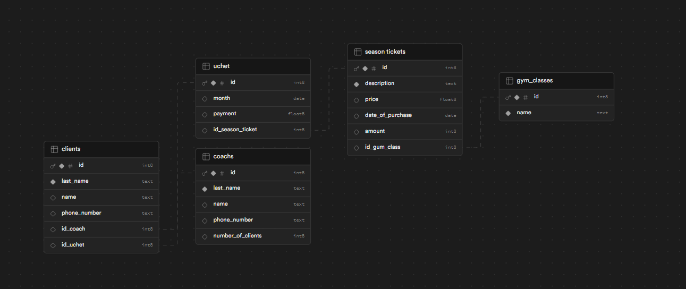
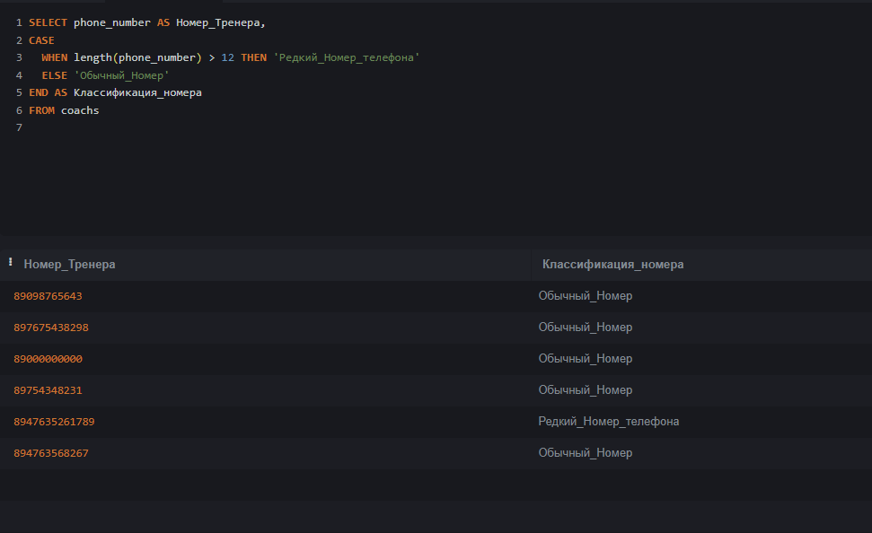

# Шакирова Арина Васильевна, группа ИС22/9-1

## 2. Описание БД
База данных спортзала, включает в себя 5 таблиц:
1)  clients (данные о клиентах);
2) coachs (данные о тренерах);
3) gum_class (номера спортзалов);
4) season_tickets (абонименты в спортзал и характеристики);
5) uchet (учет абонименетов по месяцам).

Физичесткая бд (supobase)

## 2.1 Описание Таблиц
   CLEINTS. Имеет стобцы:
1) id (айдишник таблицы, настроен по умолчанию, int)
2) last_name (фамилия, text)
3) name (имя, text)
4) phone_number (номер телефона, int)
5) id_coach (айди таблицы coachs, int)
6) id_uchet (айди таблицы uchet, int)

.png)
.png)

###    COACHS. Имеет стобцы:
1) id (айдишник таблицы, настроен по умолчанию, int)
2) last_name (фамилия, text)
3) phone_number (номер телефона, int)

.png)
.png)

###    GYM_CLASSES.Имеет стобцы:
1) id (айдишник таблицы, настроен по умолчанию, int)
2) number (номер спортзала, int)

.png)
.png)

###    SEASON_TICKETS. Имеет стобцы:
1) id (айдишник таблицы, настроен по умолчанию, int)
2) description (описание абонимента, text)
3) price (цена аюониментов, int)
4) date_s (дата начала срока действия абонемента, date)
5) amount (количество абониментов, int)
6) name_of_season_ticket (названия абониментов, text)
7) id_gym_class (айди таблицы gym_classes, int)

.png)
.png)

###   UCHET. Имеет стобцы:
1) id (айдишник таблицы, настроен по умолчанию, int)
2) month (название месяца, text)
3) payment (оплата по абонементу, int)
4) id_season_ticket (айди таблицы gym_class, int)

.png)
.png)

## 3. UNION
 Обьединение наборов строк
обьединил строки last_name из таблиц clients, coachs

   SELECT last_name
FROM clients
UNION 
SELECT last_name
FROM coachs
ORDER BY last_name

### 4. ORDER BY
 Сортировка
Упорядочение по столбцу last_name

### 5. HAVING 
 Фильтрация запросов
Отфильтровал таблицу по avg_price 

### 6. SELECT (Вложенный запрос)
 Вывод с вложенным запросом в WHERE 
Вывод результата с именем "артем"

Вывод номера телефона, где имя равно "василий"

вывод цены > 15.000 с описанием абонемента

### 7.1. АГРЕГАТНЫЕ ФУНКЦИИ 
 Математические функции 

Вывод максимальной цены из таблицы учета

Вывод самого длинного номера телефона и количество клиентов 

Вывод количества абонементов и видов абонементов 

### 7.2. РАНЖИРУЮЩИЕ ФУНКЦИИ
 Сортировка строк с одним столбцом, номер строк для нумерации.
Вывод стоблцов таблицы, возвращение ранга стобца description, возвращение нумерации 

### 7.3. ФУНКЦИИ СМЕЩЕНИЯ
 Перемещение строк относительно других
Обращение к другим данным столбца description, общение к другим данным из следующих строк,
возвращает первое значение в окне

### 8. JOIN 
  inner - Обьединяет таблицы (у меня через id)
Вывод данных о тренерах и клиетах и их номера телефонов
(coachs, clients)
 

inner - Вывод данных о тренерах и их спортзалы(номера)
(coachs, gym_classes)

inner - Вывод описания абонемента, цены, месяца действия, оплаты из таблицы учета
(season_tickets, uchet)

right - Вывод имени, фамилии клиентов и фамилиии и номера телефона тренеров

left - Вывод имени, фамилии клиентов и фамилиии и номера телефона тренеров

### 9. CASE
 Работает как конструкция IF
Сопоставление номера телефона тренера и если он меньше 12 знаков, то это редкий номер

### 9. WITH
 Создание временной таблицы 
Таблица содержит имена тренеров и клиентов

